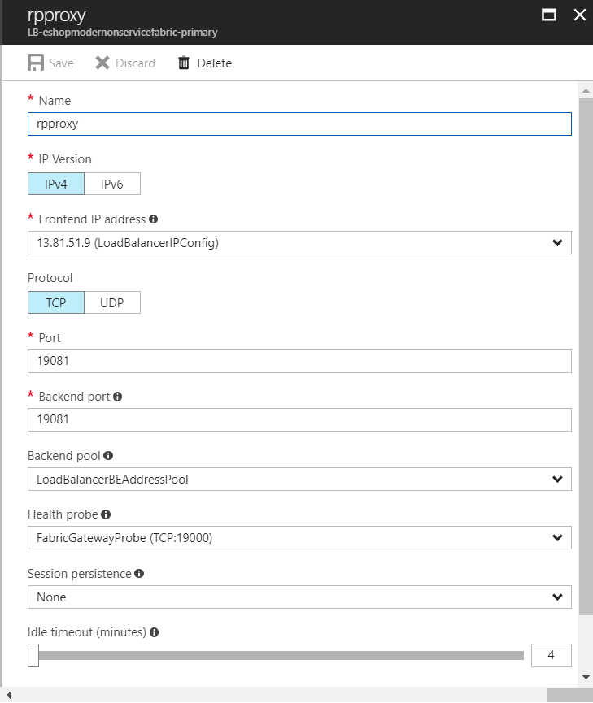
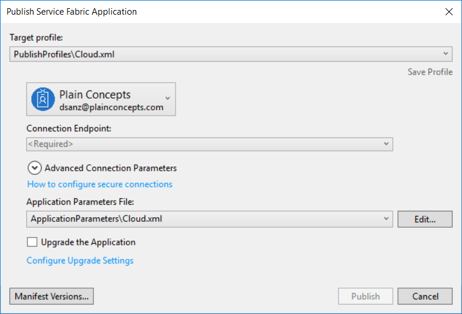

# Deploying in Azure Service Fabric

## Create the resources
You can create the resources in Azure manually or using ARM files. In the eShopOnContainers there is the ARM files to create Service Fabric. Yo can follow [this link](https://github.com/dotnet-architecture/eShopOnContainers/tree/eShopOnServiceFabric-Win/deploy/az/servicefabric/WindowsContainers) to find the files and the guide to use this files. Before deploying you must change in the paramters file _servicefabricdeploy.parameters.json_ the following parameter values:

* Clustername (not mandatory, but to not have the same name as for eShopOnContainers)
* adminUserName
* adminPassword
* applicationDiagnosticsStorageAccountName (must be unique accross al Azure)
* supportLogStorageAccountName (must be unique accross al Azure)

After change the parameters execute the az create following the instructions in the previoius link.

Once the resources are created, we need to open the external ports of the Load Balancer for the reverse proxy and for the app (this one is temporary until the reverse proxy problem is solved). Follow this steps:
1. Open the Azure Portal with the browser
2. Go to the Load Balancer of Service Fabric
3. Go to the Load Balancing Rules
4. Create one rule for the reverse proxy to open the port to external requests. Click _Add_ and fill:
    * Name: put what you want, e.g. rpproxy
    * Port: 19081
    * Backend port: 19081

    

5. Create one rule for the catalog manager container to open the port that the container is using to external requests.Click _Add_ and fill:
    * Name: put what you want, e.g. rpproxy
    * Port: 5114
    * Backend port: 5114


## Deployment in Azure Service Fabric
We will use the Visual Studio to publish 
1. Open eShopModernizedMVC.sln solution
2. Go to the eShopModernizedMVCServiceFabric project
3. Open _ApplicationPackageRoot/EShopModernizedMVCPkg/ServiceManifest.xml_ and substitute in the PicBaseIrl the part _your_service_fabric_endpoint_ by your service fabric end point:

   > ```<EnvironmentVariable Name="PicBaseUrl" Value="http://your_service_fabric_endpoint:5114/items/[0]/pic/" />```

4. Now to publish, right-click in the eShopModernizedMVCServiceFabric project and select Publish in the context menu. The form will open

    

   * Select as Target profile the PublishProfiles\Cloud.xml
   * Select the connection endpoint of your Service Fabric instance
   * Select as Application Parameters File the ApplicationParameters\Cloud.xml

5. Clisk Publish and wait while the project is being deployed in your Service Fabric resource.

## Start the application

In the browser write ```http://your endpoint:5114``` to open the application connecting directly to the container port.
If you want to open the application using the reverse proxy use the url ```http://your endpoint:19081/application name/service name```